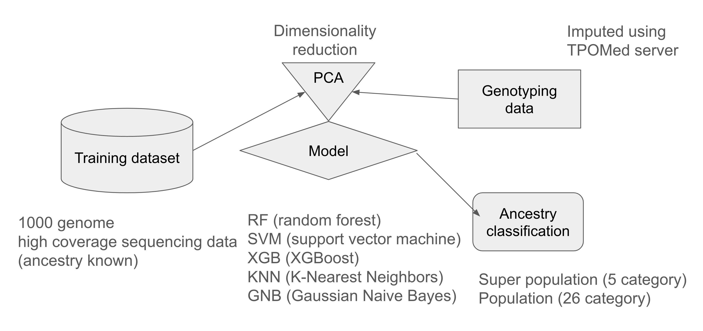

# Machine learning prediction of ancestry from the genotyping data

Han Sun, PhD, Gloyn Lab, Stanford University

----------


- The pipeline



----------

- Download the training dataset with samples of known ancestry

```
1. download the high coverage whole genome sequencing data from 1000 genome project using the script (01-Download_1000G_30x_hg38.sh)

2. extract the 2504 unrelated samples from the 3202 samples (02-SplitRelatedUnrelatedSamples.py; 03-ConcatVCFsToBimFamBed.sh)

3. (optional) update variant ID in the bim file with rsID (04-UpdateBimRs.py)

```

----------

- Impute the genotyping data using TOPMed server

```
1. merge multiple QCed arrays using plink and then update build using the update_build.sh [script](https://www.chg.ox.ac.uk/~wrayner/strand/); export to the vcf format and split by chromosomes (05-PedMap2BimFamBedVcf.sh; 06-SplitChrBgzip.py)

2. submit the vcf files to TOPMed server for imputation (07-SubmitToTOPMed.sh)

3. downlad and concat the imputed vcf files (08-GetTOPMedResults.py)

4. (optional) update variant ID in the bim file with rsID (09-UpdateVCFrs.sh)

5. export bed format from the vcf file (10-vcf2bed.sh)

```

----------

- Merge the training dataset and the imputed genotyping dataset

```

1. merge the datasets using the script (11-MergeDatasets.py), 

based on the [post](https://martha-labbook.netlify.app/posts/extracting-data-for-variants-common-in-both-file-sets/) to handle multiple positions and alleles. 

```

----------

- PCA analysis of the merged dataset

```
1. doing the PCA analysis on the merged dataset using the R package bigsnpr, 

including relatedness testing and outlier detection (12-PCA.R)

The essential output is the PCs of the PCA for each sample, which is used as input for the machine learning prediction.
```


----------

- Machine learning prediction on the first 20 PCs from the PCA analysis

```
1. doing machine learning prediction using scikit-learn (13-AncestryML.py), 

with config files (Config01.yaml and Config02.yaml, for super population and population respectively)

After evaluating multiple models, such as random forest, random forest with balanced weights, SVM, XGBoost, KNN, GNB, etc., 

we moved forward with the random forest with balanced weights, which archived 99% and 90% accuracy for super population and population prediction.
```

----------
